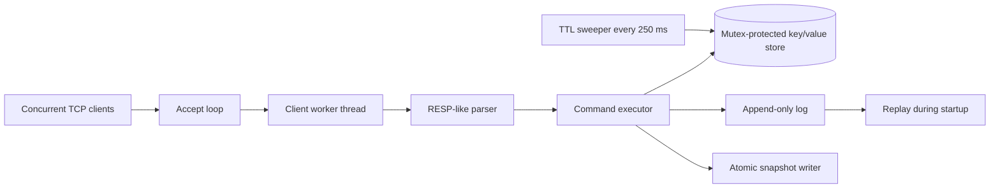
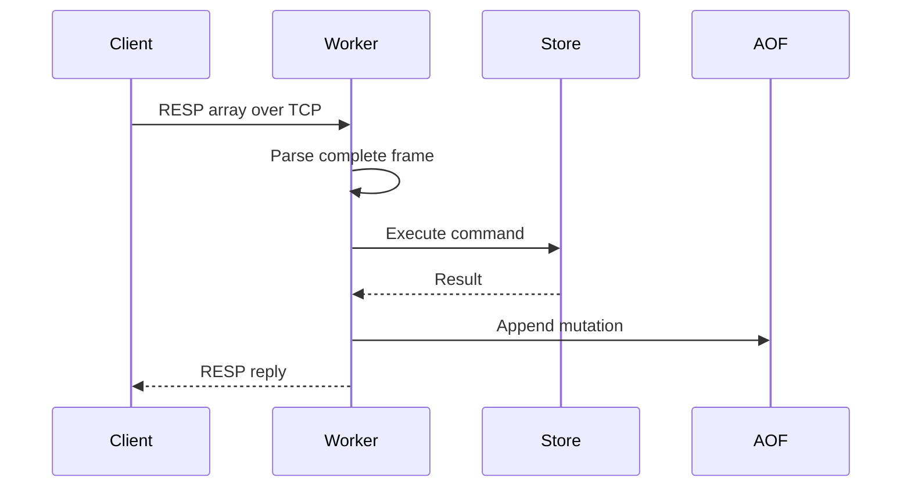

# SpaceDB

`SpaceDB` is a small Redis-like in-memory database written in C++17. It is an educational server, not a Redis wrapper: the TCP listener, request parser, storage engine, expiration loop, append-only log, and snapshot writer are implemented in this repository.

## Current scope

| Capability | Status | Design |
| --- | --- | --- |
| TCP server | Done | POSIX socket, one detached worker per client |
| RESP-like protocol | Done | RESP arrays of bulk strings |
| `GET`, `SET`, `DEL`, `EXPIRE` | Done | String values and millisecond/second TTLs |
| Concurrent clients | Done | Per-client workers and a mutex-protected store |
| TTL management | Done | Lazy expiration on access plus a 250 ms sweeper |
| Append-only persistence | Done | Tab-escaped command log, replayed at startup |
| Snapshotting | Done | `SAVE` writes an atomic `dump.rdbx` export |
| Benchmarks | Done | Dependency-free Python benchmark |
| Replication | Planned | Primary log streaming and replica offset protocol |

## Build and run

Requirements: Linux, a C++17 compiler, pthreads, and CMake 3.16+ (or invoke `g++` directly).

```sh
cmake -S . -B build
cmake --build build
./build/SpaceDB 6379 ./data
```

The server prints its listening address. The default data directory is `./data`; it contains `appendonly.aof` and, after `SAVE`, `dump.rdbx`.

## Protocol

Requests are RESP-style arrays. Every argument is a bulk string:

```text
*2\r\n$3\r\nGET\r\n$4\r\nname\r\n
```

Supported commands:

```text
PING                       -> +PONG
SET key value              -> +OK
SET key value PX ms        -> +OK
GET key                    -> bulk value or $-1
DEL key                    -> :1 or :0
EXPIRE key seconds         -> :1 or :0
SAVE                       -> +OK
INFO                       -> bulk key count
```

Example using Python's standard library:

```python
import socket

def command(*parts):
    request = f"*{len(parts)}\\r\\n" + "".join(
        f"${len(part)}\\r\\n{part}\\r\\n" for part in parts
    )
    with socket.create_connection(("127.0.0.1", 6379)) as client:
        client.sendall(request.encode())
        print(client.recv(4096).decode())

command("SET", "language", "cpp")
command("GET", "language")
```

## Architecture

### Project layout

```text
include/SpaceDB/
    types.hpp       Shared Entry and snapshot data types
    store.hpp       Thread-safe in-memory key/value API
    aof.hpp         Append-only log API
    snapshot.hpp    Snapshot export API
    protocol.hpp    RESP-like framing and replies
    server.hpp      TCP server and command dispatch API
src/
    store.cpp       TTL-aware storage implementation
    aof.cpp         Durable command append and replay
    snapshot.cpp    Atomic snapshot writer
    protocol.cpp    Request parser and response formatters
    server.cpp      Accept loop, client workers, and commands
    main.cpp        Process startup and command-line arguments
```

### OOP responsibilities

The classes have one clear reason to change:

- `Store` encapsulates the database state and protects it with a mutex.
- `AppendOnlyLog` encapsulates the persistence format and replay callback.
- `Snapshot` provides a stateless snapshot export service.
- `Protocol` provides stateless RESP-like parsing and response formatting.
- `Server` composes the other objects and owns network/thread lifecycle.

Composition keeps the server dependent on small interfaces instead of making storage, disk I/O, and sockets one large class. It also gives future tests a direct seam for exercising storage and protocol behavior without opening a TCP port.



The store owns the data invariant: a key is either absent, or has a value and an optional absolute expiration time. `GET`, `EXPIRE`, and the sweeper remove expired records. The mutex keeps individual store operations safe while independent client threads run concurrently.

## Command flow



Mutation order is store first, then append. This keeps a successful client reply tied to an in-memory mutation and a flushed log entry. A production implementation would use a single durability transaction or a journal sequence number to make crash recovery stronger.

## Persistence concepts

### Append-only log

Every successful `SET`, `DEL`, and successful `EXPIRE` is written as one escaped tab-separated command. On startup, the log is replayed through the same command executor with persistence disabled. This keeps recovery logic close to normal command semantics. The current prototype uses relative `EXPIRE` commands, so a future durability pass should record absolute expiration timestamps.

### Snapshot

`SAVE` copies live entries while holding the store lock, writes a temporary file, and renames it over `dump.rdbx`. Rename makes replacement atomic on the same filesystem. Snapshot loading and log compaction are deliberately next steps; startup currently relies on AOF replay.

## Concurrency model

The accept loop only accepts sockets. Each socket gets a detached thread, which reads and parses multiple pipelined requests. Store operations are short critical sections guarded by one mutex. The sweeper uses the same lock. This favors clarity over maximum throughput; a sharded map or event loop can be introduced after measuring contention.

## Testing and benchmarks

Compile without CMake when needed:

```sh
g++ -std=c++17 -Wall -Wextra -Wpedantic -pthread src/main.cpp -o SpaceDB
./SpaceDB 6379 ./data
python3 bench/benchmark.py --requests 10000
```

The benchmark reports request/response throughput for sequential `SET` commands. It is a baseline, not a formal performance claim. Add latency percentiles, multiple client connections, and payload-size distributions before comparing design changes.

## Roadmap

1. Load `dump.rdbx` on startup and compact the AOF after a successful snapshot.
2. Record absolute expiration deadlines in the AOF.
3. Add a bounded worker pool or an event-driven networking layer.
4. Add `MGET`, pipelining tests, malformed-frame limits, and fuzz tests for the parser.
5. Add replication: handshake, primary stream, replica offset, acknowledgements, and reconnect/resync behavior.